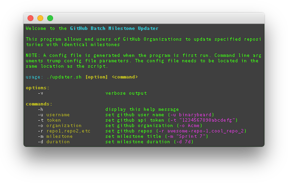

# Batchy McBatchface



### Examples

```
./updater.sh
```
###### Standard command. Pulling all information from the local config file

```
./updater.sh -v
```
###### Same as above with a lot more logging to the console

```
./updater.sh -o ableat -r linux-kernel,web-app -m "Sprint 10" -d 7d
```
###### Updating the ableat organization's linux-kernel and web-app repositories with a milestone title of Sprint 10 and a duration of 7 days

```
./updater.sh -m "2.0.0 Release" -d 30d
```
###### Updating organization repositories (provided by the config file) with a milestone title of 2.0.0 Release and a duration of 30 days

## Contributing

We welcome contributions from every type of person. If you're new to coding, **great**! If you've never contributed to an open-source project, **awesome**! If you're a super seasoned engineer and find a bug, typo, bad logic, etc., **phenomenal**!

We have no formal git-flow or guidelines to submit a pull request, yet, so if you think something should change, [Create an Issue](https://github.com/ableat/batch-milestone-updater/issues/new) or write some code and Submit a Pull Request.

### Maintainers

This project is maintained by [Sam](https://github.com/binarybeard) and [Eli Gladman](https://github.com/egladman) with many contributions coming from [stephendp](https://github.com/stephendp) and [Jim Taylor](https://github.com/jalama). Make a contribution and you'll be on the list 😉

## License

Code is under the [MIT License](LICENSE). Documentation is under the [Creative Commons Attribution license]().
